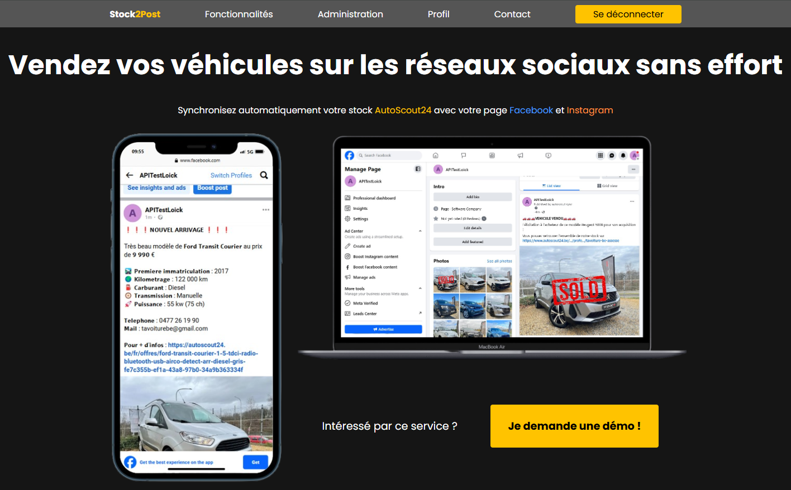
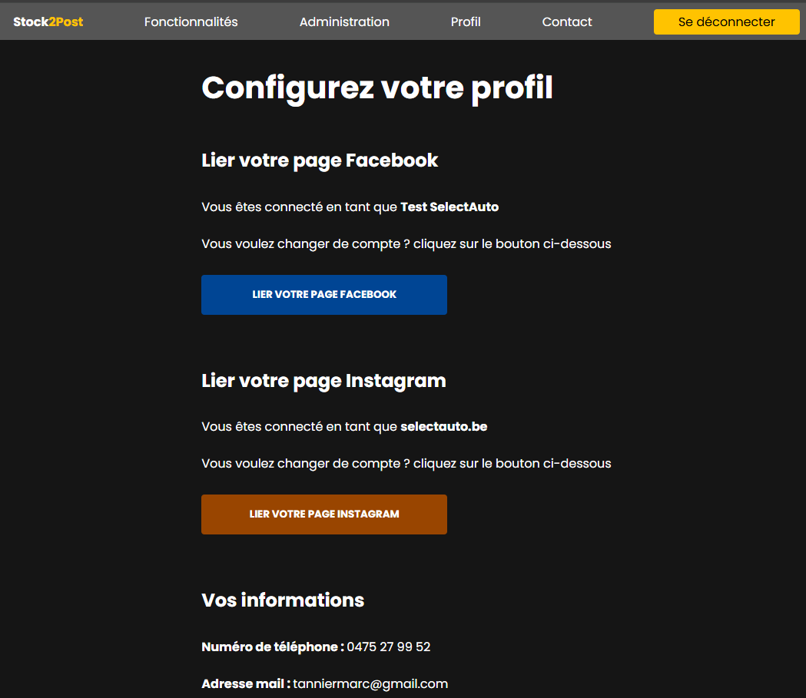
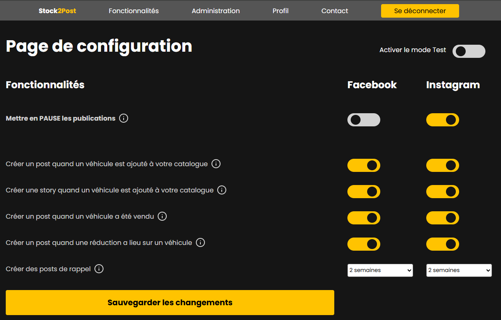
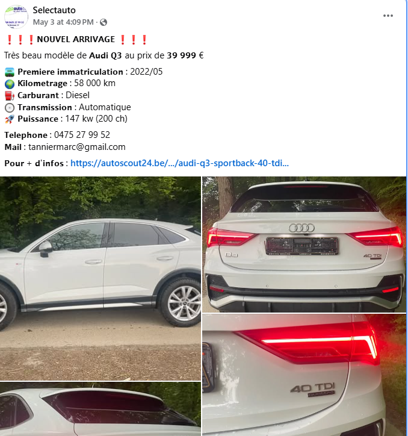

# Stock2Post
This tool allow professionnal cars dealer that are on AutoScout24 https://www.autoscout24.be/ to synchronise their stock with their social networks page (Instagram and Facebook)

The app : https://stock2post.be (now down because of AutoScout24 condition of use)

## The problem

Car dealers have a lot of changes in their stock. They add new cars every day, change prices of cars, sell cars etc. They do this through their AutoScout24 professionnal page.

Most of them are also on social network to promote their activity. However most of them ends with a dead pages since it take too much time to keep their socials active ; they need to reupload all pictures, put the description, making a post when the car is not available anymore, or when there is a discount etc.

So basically everything they are doing on their AutoScout24 stock, they could need to do it for their Facebook and Instagram pages, every day. And it takes a lot of time.

## The solution

One simple solution to this problem is <b>Stock2Post.be</b>. It parse the AutoScout24 stock of registered dealers multiple time a day to detect whether there are new ads, discount and so on to publish on social networks.

The tool allow each dealer to map one Facebook and Instagram page to their account so that the automation can start. They also can configure which type of posts they want for each of their socials (Only new ad post, also post stories, post cars that are in the stock since a logn time and that have not been sold etc.)

## How it works

### Data retrieval

The system retrieves vehicle data by parsing the public AutoScout24 dealer pages. Each registered dealer's stock page is fetched and analyzed using BeautifulSoup to extract:
- Vehicle details (model, price, mileage, fuel type, transmission, power)
- Images and thumbnails
- Technical specifications and equipment lists
- CarPass information when available

The parsing runs multiple times per day via scheduled Celery tasks to detect:
- **New arrivals**: Vehicles appearing in the stock that weren't there before
- **Price changes**: Comparing current prices with previously stored values to detect discounts
- **Sold vehicles**: Vehicles that were in stock but are no longer listed

### Request distribution

To ensure reliable data retrieval and avoid overloading any single endpoint, the system distributes requests across multiple network paths. This approach helps maintain consistent service availability and prevents any single point from being overwhelmed by repeated requests.

  

### Accouts mapping

The page where the dealer can link his socials.

  

### Posts configuration

The page where the dealer can configure the type of posts to publish.

  

### Posts Examples

New car arrival

  

Discount on a car

  

Car sold

  

## Technologies used

